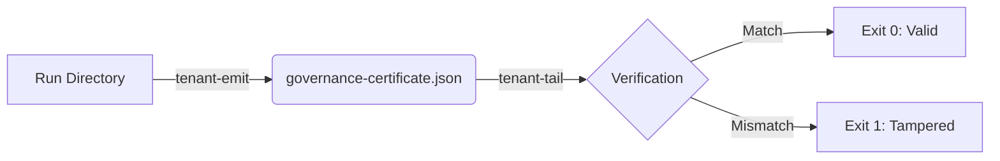

# Emit vs Verify

The architecture of the governance toolkit enforces a strict, load-bearing boundary between emitting a certificate and verifying it.

## The Boundary

`tenant-emit` is **emit-only by construction**. It contains no verification logic, no verify verb, and no dependency on the verifier crate. It scans a run directory, computes hashes, signs the payload, and writes the JSON file.

Conversely, [`tenant-tail`](https://github.com/stagecraft-ing/tenant-tail) is verify-only. It reads the certificate, re-derives the canonical JSON, checks the Ed25519 signature, and asserts the integrity of the run. It cannot emit.

This separation ensures that the system producing the audit paperwork is structurally distinct from the system verifying it.

## The Round-Trip Guarantee

The cross-tool round-trip is the definition of correct behavior.

A certificate emitted by `tenant-emit build-certificate` must verify cleanly under `tenant-tail verify-certificate`. If any artifact in the run directory is tampered with, or if the corpus attestation is altered, verification must fail (exit 1).

Because both tools share the exact same Data Transfer Objects (DTOs) extracted from the upstream engine, the canonical JSON, the self-hash, and the signature remain byte-identical across the emit/verify boundary.

